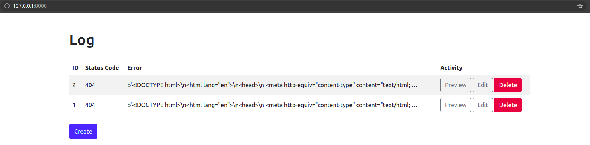
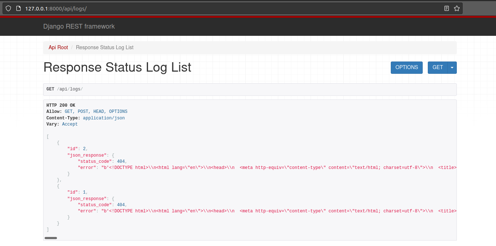

# Demo Page



# Setup
Get Project from Git
```sh
git clone https://github.com/akashdobariya2702/FullStackDjangoMWare.git
```

# Installation and Run Server
This will setup virtual environment, install packages and run the server using `settings.py` file
```sh
source dj_run.sh
```
# To create dummy Log entry in DB for 404 Error
Open http://127.0.0.1:8000/api/dummy/

# Now you can test website
Open http://127.0.0.1:8000/ URL in the brower (ex. Chrome)

# To test API
Open http://127.0.0.1:8000/api/logs/

# Postman collection for the APIs. (::JSON Link)
```
https://www.getpostman.com/collections/b9660dee3175352269e1
```
